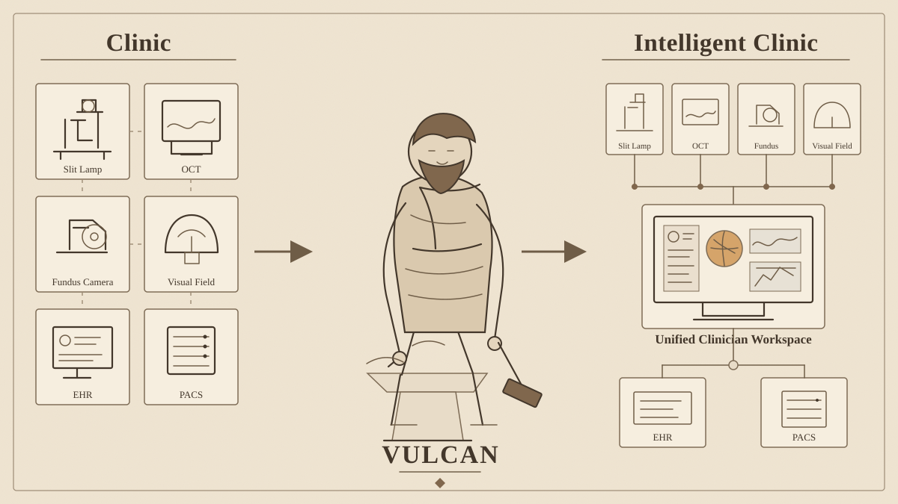

# VULCAN

**Healthcare systems, forged on demand.**



VULCAN is a research-first prototype for an AI-native healthcare software foundry.

## The idea

We believe the next generation of healthcare software companies may be **AI-native companies operated primarily by AI rather than human software teams**. Healthcare infrastructure is increasingly complex, heterogeneous and fast-moving: every clinic may have different devices, workflows, EHRs, PACS, networks, data structures and operational constraints. At the same time, remaining at the frontier of AI will require software to evolve much faster than conventional one-product-for-all development can support.

VULCAN therefore does **not** aim to create another general healthcare software product. The company itself is the product: an AI-native software company that receives the needs and infrastructure of a healthcare organisation, understands that unique environment, builds software specifically for it, simulates its behaviour, tests it against objective requirements, and prepares it for deployment according to the standards and constraints of that environment.

```text
understand → build → simulate → test → govern → deploy
```

The intended software-generation process does not depend on a human software-development team. AI performs the receiving, modelling, engineering, testing and adaptation. Where clinical, legal or regulatory governance requires accountable human approval, that remains an external approval gate rather than part of the software-construction process.

The goal is simple: **give every unique healthcare infrastructure the technology it specifically needs to operate at the frontier of the AI era — software made on demand for that environment, not one software product imposed on every clinic.**

## Core loop

```text
Collected clinic facts
        ↓
EnvironmentSpec
        ↓
Clinic Ontology
        ↓
User need + trusted components
        ↓
Acceptance tests
        ↓
SafetyGate
        ↓
Generate/evolve software
        ↓
VULCAN ClinicGym
        ↓
Objective verification
        ↓
Silent validation → limited pilot
```

VULCAN does not permit the coding layer to invent missing EHR, PACS, FHIR, DICOM or network capabilities.

## Evidence-grounded environment

Every environment fact has a provenance state: `verified`, `discovered`, `declared`, `inferred`, `conflicting`, or `unknown`.

Required facts that are missing, inferred, conflicting or unsupported block generation. Concrete integration endpoints are required before connector code can be generated.

This environment model is grounded in established interoperability standards rather than vendor assumptions: [IHE Eye Care / Unified Eye Care Workflow](https://wiki.ihe.net/index.php/Unified_Eye_Care_Workflow) for ophthalmic workflow and system actors, [DICOM PS3.2](https://dicom.nema.org/medical/dicom/current/output/chtml/part02/PS3.2.html) for device and PACS conformance capabilities, and [HL7 FHIR CapabilityStatement](https://hl7.org/fhir/R4/capabilitystatement.html) for discoverable EHR/API capabilities. See [`docs/EVIDENCE_BASE.md`](docs/EVIDENCE_BASE.md).

## Software-on-demand foundations

VULCAN now adds four machine-readable layers before deployment:

- **Clinic Ontology** — converts collected facts into clinic objects and relationships.
- **Trusted Component Catalog** — selects reusable FHIR, DICOM, audit and approval building blocks.
- **Acceptance Contract** — defines objective pass/fail tests before candidate software is accepted.
- **Deployment Plan** — enforces `ClinicGym -> silent validation -> limited pilot` with rollback.

These choices are informed by successful patterns from Palantir Ontology, ServiceNow application development/Build Agent, Replit Agent, SWE-bench, MedAgentBench and Waymo simulation. References and implementation mapping are in [`docs/EVIDENCE_BASE.md`](docs/EVIDENCE_BASE.md).

## DeploymentGym / GovernanceGate

**Need.** Generating software that works is not the same as generating software that a real healthcare organisation can deploy. In the NHS, for example, [DCB0129](https://digital.nhs.uk/data-and-information/information-standards/governance/latest-activity/standards-and-collections/dcb0129-clinical-risk-management-its-application-in-the-manufacture-of-health-it-systems) defines clinical-risk-management requirements for organisations developing and maintaining health IT, while [DCB0160](https://digital.nhs.uk/data-and-information/information-standards/governance/latest-activity/standards-and-collections/dcb0160-clinical-risk-management-its-application-in-the-deployment-and-use-of-health-it-systems) addresses deployment and use by healthcare organisations; NHS England states that compliance with these standards is mandatory. **VULCAN's answer** is a future **DeploymentGym / GovernanceGate**: after ClinicGym establishes that generated software behaves correctly, this second gate asks whether the clinic-specific system has the evidence, safety controls, integration assumptions and deployment conditions required by that clinic's own environment. The goal is not to turn VULCAN into another generic health platform, but to make deployment constraints part of the AI-native foundry so that software-on-demand is generated for the unique clinic and for the real system in which it must operate.

## Autonomous software evolution

`POST /forge/evolve` implements an ERA-inspired software search loop:

`generate -> compile/objectively score -> select -> mutate -> repeat`

Each evolution task is seeded with:

```text
environment.json
clinic_ontology.json
components.json
acceptance_tests.json
deployment_plan.json
```

The search uses rank-based Flat-UCB/PUCT-style exploration. Safety and environment grounding are hard gates, not optimization metrics. Generated Python is syntax-checked without executing arbitrary candidate code in this draft.

Methodological basis: Aygun et al., *Nature* 2026, doi:10.1038/s41586-026-10658-6.

## VULCAN ClinicGym

`clinicgym/` is a synthetic executable ophthalmology clinic used to test generated software before any real deployment.

Current draft includes:

- [HAPI FHIR JPA Server](https://github.com/hapifhir/hapi-fhir-jpaserver-starter) as a fake EHR;
- [Orthanc](https://www.orthanc-server.com/) as a fake PACS/DICOM server;
- a verified synthetic `EnvironmentSpec`;
- an objective verifier;
- normal and fault scenarios including FHIR timeout, PACS outage, wrong patient, malformed DICOM, network interruption and unauthorized write attempts.

The executable healthcare environment follows [MedAgentBench](https://stanfordmlgroup.github.io/projects/medagentbench/); objective software verification follows [SWE-bench](https://github.com/SWE-bench/SWE-bench); multi-system scenario/checkpoint design is informed by [HealthAdminBench](https://arxiv.org/abs/2604.09937) and [WebArena](https://webarena.dev/); extensive failure-scenario simulation is inspired by [Waymo](https://waymo.com/waymo-driver/) as a safety-engineering analogy. Full mapping is in [`clinicgym/README.md`](clinicgym/README.md).

## Current prototype

The prototype can:

- capture an ophthalmology clinic in evidence-grounded `EnvironmentSpec`;
- convert that environment into a machine-readable clinic ontology;
- select trusted reusable healthcare components;
- generate acceptance tests from the requested capability;
- compile a natural-language need into `SystemSpec`;
- block generation when required clinic facts are unavailable;
- evolve candidate applications using objective scores and Flat-UCB search;
- generate FHIR/DICOM connector configuration only from collected facts;
- simulate a minimal EHR/PACS clinic environment for safe testing;
- define staged deployment and rollback requirements;
- preserve the clinical `SafetyGate`.

## Quick start

```bash
python -m venv .venv
source .venv/bin/activate  # Windows: .venv\\Scripts\\activate
pip install -e '.[dev]'
pytest -q
uvicorn vulcan.api.app:app --reload
```

ClinicGym:

```bash
docker compose -f clinicgym/docker-compose.yml up
```

Open `http://127.0.0.1:8000/docs`.

## API

```text
GET  /health
POST /forge
POST /forge/grounded
POST /forge/evolve
POST /manifest
```

## Design principles

1. Facts before generation.
2. Model the clinic before coding.
3. Prefer trusted reusable components over reinvention.
4. Define acceptance tests before accepting software.
5. Simulate before deployment.
6. Objective tests over LLM self-judgement.
7. Safety constraints cannot be traded for score.
8. Human authority for clinical actions.
9. Monitoring and rollback are part of deployment.
10. Evidence over demo quality.

## Status

Research prototype only. Not a medical device. Not for clinical care. No autonomous diagnosis or treatment is implemented.

**Ask for a healthcare capability. Receive the system.**
